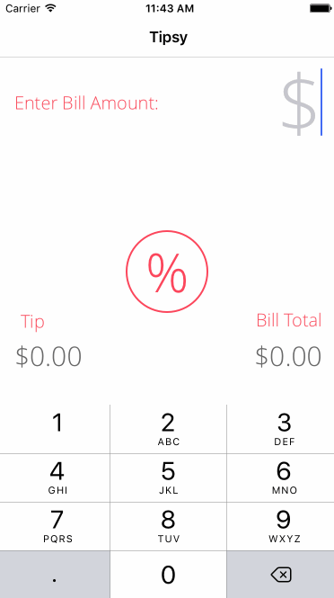

Pre-work - Tipsy

Tipsy is a tip calculator application for iOS.

Submitted by: Joanna Lund

Time spent: 22 hours

## User Stories

The following **required** functionality is complete:
* [yes] User can enter a bill amount, choose a tip percentage, and see the tip and total values.

The following **optional** features are implemented:
* [yes] Custom font
* [yes] UI animations
* [no] Making sure the keyboard is always visible and the bill amount is always the first responder. This way the user doesn't have to tap anywhere to use this app. Just launch the app and start typing.

The following **additional** features are implemented:

- default tip percentage is set to 20%, customization is optional.
- changed tip options to separate buttons

## Notes

Describe any challenges encountered while building the app.
- bugs while creating custom buttons and animations

